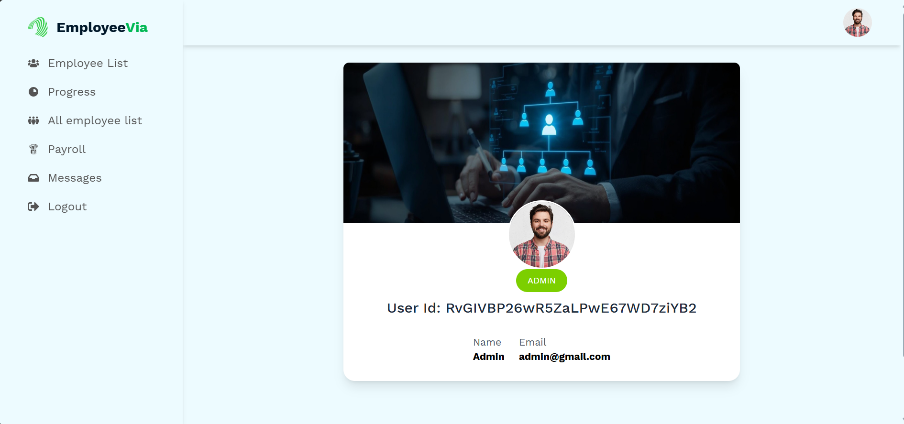

# 🌟 EMPLOYEE MANAGEMENT SYSTEM

A powerful, secure, and modern web app for managing employees, workload, payrolls, and admin-level operations — built with **React**, **Firebase**, **MongoDB**, and **Tailwind CSS**.

> 🚀 **Live Site:** [https://employeevia.web.app/](https://employeevia.web.app/)

---

## 👤 ADMIN LOGIN

- **Email:** `admin@gmail.com`
- **Password:** `@Admin`

---

## 🔥 FEATURES

✅ **Role-Based Access Control**

- Users are assigned roles: **Employee**, **HR**, and **Admin** with specific permissions.

✅ **Firing Employees**

- Admins can “fire” users; fired employees are blocked from future logins.

✅ **Work Sheet Submission**

- Employees can log daily work by task, hours, and date; entries are editable.

✅ **Employee Verification**

- HRs can verify/unverify employees, enabling/disabling their access to payment features.

✅ **Payroll System**

- HRs can create salary entries; Admins process the final payments.

✅ **Payment History**

- Employees can view their own payment records and statuses.

✅ **Progress Filter**

- View progress of any employee by name and month using dynamic dropdown filters.

✅ **Responsive Dashboard**

- Mobile-friendly layout with animated sidebars, protected routes.

✅ **Contact Form**

- Visitors can send messages; Admins can read and manage user-submitted feedback.

---

## 🛠️ Tech Stack

- **Frontend:** React, React Router, Tailwind CSS, Headless UI/ Flowbite (UI Components)
- **Backend:** Express.js, MongoDB, JWT
- **Authentication:** Firebase (Email + Google)
- **Payment System:** Stripe
- **State Management:** TanStack Query (React Query)
- **Deployment:** Firebase Hosting (client) & Vercel (server)

---

## 🧠 Designed For

- HR and Admins to manage staff effectively
- Employees to track their contributions and salaries
- Transparency between staff and management

---

## 📸 Screenshot Preview

